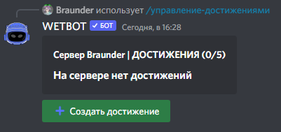

# 🏆 Create achievements

To create an achievement, you need to execute the command /manager-achievements

<figure><figcaption></figcaption></figure>

After clicking the create achievement button, a window with settings will appear where you can configure the achievement and select the type of achievement.\
\
Types of achievements with which questions arise:

* Custom goal - you specify yourself what needs to be done to complete this achievement (Note that the participant will not automatically receive this achievement, only administrators can give this achievement)
* Spend XX hours in a voice chat - The member will have to spend a total of XX hours in a voice chat (There must be more than one member with the microphone turned on. ! Bots do not count as participants in the voice channel ! )
* Get XX likes - command /like
* Bump the server XX times - it all depends on the bot you use for monitoring (Standard commands /bump, /up, /like)
* Find all items - Extraordinary rarity items are not counted

In the "Edit Achievement" panel, you can change the name/ add items related to the goal/ change the achievement emoji and so on
