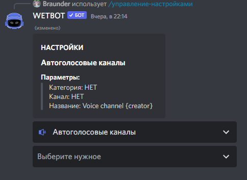

# Автоголосовые каналы

Выбираем в панели настроек [/manager-settings](../commands/admins.md) в выпадающем меню **Автоголосовые каналы**

<figure><figcaption></figcaption></figure>

В меню **Выберите нужное** выбираем категорию в которой будут наши голосовые каналы, выбираем канал, в который нужно будет зайти, чтобы создать авторский канал и название канала.


Создайте отдельную категорию для ваших авторский голосовых каналов, потому что бот удаляет каналы, если в них нет участников за исключением канала - кнопки.



Можете употреблять [переменные](../variables/avc.md) для названия канала:

> **{creator}** - имя пользователя канала
>
> **#** - номер канала в формате 1 2
>
> **{emoji}** - случайный эмодзи

