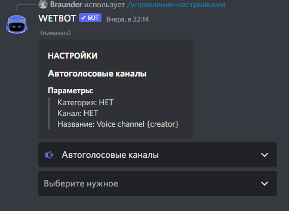

# Autovoice channels

## What is this?

Join-to-create: a member joins a trigger channel, the bot creates a temporary voice channel and deletes it when everyone has left.

## Discord

In [/manager-settings](../commands/admins.md), choose **Autovoice channels**.

<figure><figcaption></figcaption></figure>

| Parameter | Description |
| --- | --- |
| Creation channel | The trigger voice channel |
| Category | Where to create the temporary channels |
| Name | The channel name template |


Create a separate category for autovoice channels: the bot deletes empty channels (except the trigger channel).



Name variables: [AVC variables](../variables/avc.md)

> **{creator}** — creator's name  
> **#** — channel number  
> **{emoji}** — random emoji


The bot must have the permissions to manage channels and move members (see the [introduction](../README.md)).

## On the website


[roles-avc.md](../website/settings/roles-avc.md)

