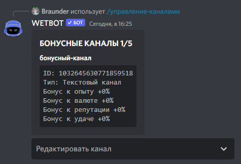

# Create bonuses channels

To add a bonus channel, we execute the command /manager-channels create \<channel>

<figure><figcaption></figcaption></figure>

Next, in the "Edit Channel", you can specify bonuses to experience / currency / reputation and luck as a percentage, as well as delete the bonus channel.

### What types of activities are bonuses given for:

1. Sending messages in the channel (Currency, experience, reputation, luck)
2. Voice channel communication (Currency, Experience, Reputation, Luck)
3. Using the command /fishing in the channel, fishing (only experience and luck)
4. Using the /mining command in the channel, mining (only experience and luck)
5. Reward for server bump (Currency, Experience, Reputation, luck)
6. Using the /open command in the channel, opening cases (only luck)
