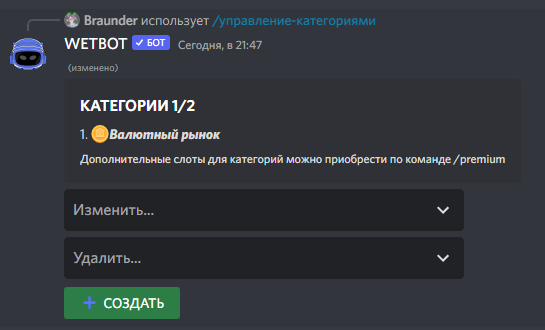

# Создание категории в магазине


[items](items/)



[Broken link](broken-reference)


Вызываем панель для редактирования категорий командой [/manager-categories](../commands/admins.md)

<figure><figcaption></figcaption></figure>

После чего бот попросит назвать категорию и указать эмодзи категории

<figure><figcaption></figcaption></figure>

После этого категория готова, осталось добавить туда предметы для покупки. Нажимаем `Изменить...` и выбираем нашу категорию

<figure><figcaption></figcaption></figure>

Здесь можно изменить:

1. Название категории
2. Эмодзи
3. Добавить сам предмет (Он добавлении предмета далее)
4. Указать права на покупку (Роль с которой участник сможет покупать от туда предметы)
5. Стандартная категория

Чтобы добавить предмет в категорию, нужно указать его ID

<figure><figcaption>
Можете употреблять переменные:<strong>Можете употреблять переменные:</strong>
</figcaption></figure>
