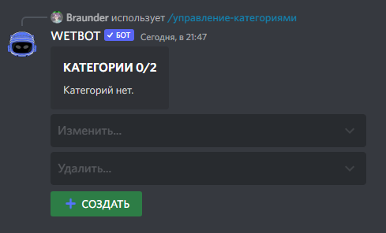
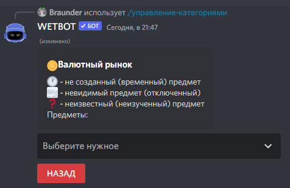

# Creating a shop category

## What is this?

Categories group products in `/shop`. Items are first set up for the shop and then added to a category.


Limit: **5** without premium, **25** with premium.



[items](items/)



[shop.md](items/shop.md)


## Discord

Command [/manager-categories](../commands/admins.md)

<figure><figcaption></figcaption></figure>

The bot will ask for the category name and emoji.

<figure><figcaption></figcaption></figure>

Next, **Edit…** → select a category:

<figure><figcaption></figcaption></figure>

| Parameter | Description |
| --- | --- |
| Name / emoji | Appearance |
| Items | IDs of the category's items |
| Purchase permissions | Who can buy from the category |
| Default category | The default category |

## On the website


[categories.md](../website/categories.md)

