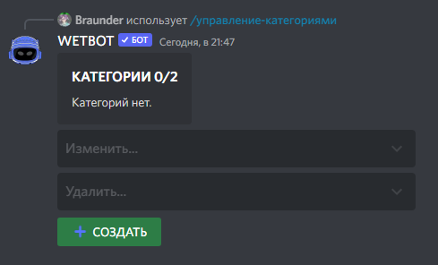

# Create category for shop


[items.md](items.md)



[shop.md](shop.md)


Execute the panel for editing categories with the command /manager-categories

<figure><figcaption></figcaption></figure>

After that, the bot will ask you to name the category and specify the category emoji

<figure><figcaption></figcaption></figure>

After that, the category is created, it remains to add items for purchase there. Click Edit... and choose our category

<figure><figcaption></figcaption></figure>

Here you can change:

1. Category name
2. Emoji
3. Add an item
4. Setting category as Standard category

To add an item to a category, you need to specify its ID

<figure><figcaption></figcaption></figure>
