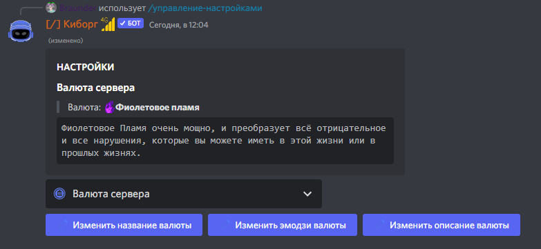

# Setting server currency

In order to set up the server currency, you need:

* Execute command [/manager-settings](../commands/admins.md)
* Select **Server currency** from the drop-down menu

Here you can use the buttons to customize the currency emoji, currency name and currency description

<figure><figcaption>
Предварительный просмотр и кнопки настроек
</figcaption></figure>


Setting a server emoji for currency is available in [premium](../premium.md)

