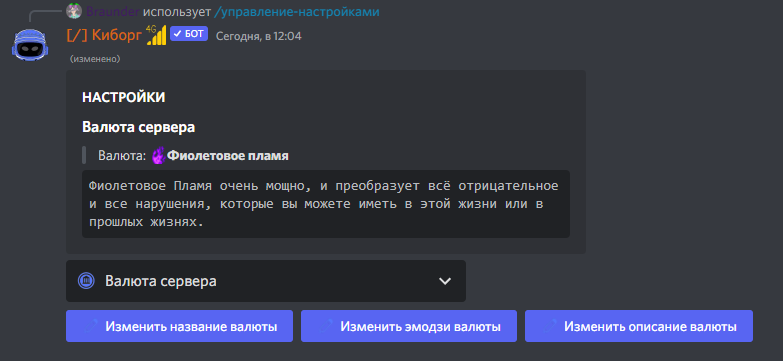

# Setting up the server currency

## What is this?

The server currency is the main unit of the economy (purchases, transfers, crash, rewards).

## Discord

1. Run the [/manager-settings](../commands/admins.md) command
2. Choose **Server currency**

<figure><figcaption>
Preview and settings buttons
</figcaption></figure>

Available options:

| Setting | Description |
| --- | --- |
| Name / description | How it is shown in commands |
| Emoji | Standard or server emoji |
| Ban on transfer / drop / crash | Restrictions |
| Transfer / drop permissions | Via permission presets |


A custom server emoji for the currency is available with [premium](../premium.md).


Don't confuse it with :cookie: cookies (the premium currency) — see [Premium](../premium.md).

## On the website


[general-currency.md](../website/settings/general-currency.md)

