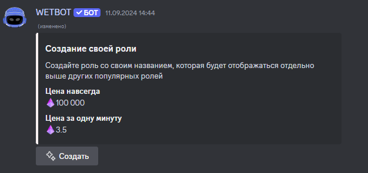

# Достижения

## Создание достижения

Для создания достижения выполняем команду[ /manager-achievements create <название достижения>](../../commands/admins.md)

<figure><figcaption></figcaption></figure>

## Редактирование достижения

Для редактирования достижения выполняем команду [/manager-achievements edit <название достижения>](../../commands/admins.md)

<figure><figcaption></figcaption></figure>

## Удаление достижения

Для удаления достижения выполняем команду [/manager-items achievements <название достижения>](../../commands/admins.md)

<figure><figcaption></figcaption></figure>

## Копирование достижения

Для копирования достижения  выполняем команду [/manager-achievements copy <название достижения> <название нового достижения>](../../commands/admins.md)

<figure><figcaption></figcaption></figure>

## Руководство по управлению достижением

***


[tipy-zadach-dostizheniya.md](tipy-zadach-dostizheniya.md)



[nagrady-dostizheniya.md](nagrady-dostizheniya.md)



[emodzi-dostizheniya.md](emodzi-dostizheniya.md)



[deistviya-s-dostizheniem.md](deistviya-s-dostizheniem.md)

