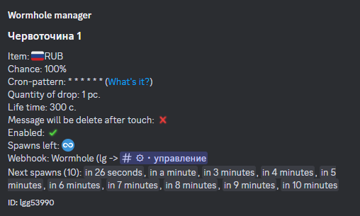

# Items

## Creating an item

To create an item, execute the command[ /manager-items create <item name>](../../commands/admins.md)

<figure><figcaption></figcaption></figure>


The maximum length of the name of the item 30 characters


## Editing the item

To edit the item, execute the command [/manager-items edit <item name>](../../commands/admins.md)

<figure><figcaption></figcaption></figure>

## Removing the item

To delete the item, execute the command [/manager-items delete <item name>](../../commands/admins.md)

<figure><figcaption></figcaption></figure>

## Copying the item

To copy the item, execute the command [/manager-items copy <item name> <name of new item>](../../commands/admins.md)

<figure><figcaption></figcaption></figure>

## Item management guide

***

#### Adding an item to a shop


[shop.md](shop.md)


***

#### Creating cryptocurrency


[cryptocurrency.md](cryptocurrency.md)


***

#### Auto-delivery of items to shop


[auto-delivery.md](auto-delivery.md)


***

#### Craft of the item


[craft.md](craft.md)


***

#### Creating a case


[case.md](case.md)


***

#### Using the item


[use.md](use.md)


***

#### Ways to obtain an item


[obtaining.md](obtaining.md)

