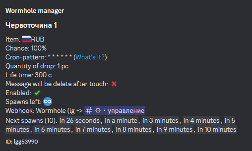

# Items

Items are the foundation of the economy: the shop, crafting, cases, drops, and `/use`.


Slot limit: **25** without premium, **1000** with premium. See [Premium](../../premium.md).


The editor also lets you configure properties (known, visible, transferable…), permissions, and cooldowns. The full catalog of fields is on the [website](../../website/items.md).

## Creating an item

To create an item, run the command[ /manager-items create <item name>](../../commands/admins.md)

<figure><figcaption></figcaption></figure>


The maximum length of an item name is 30 characters


## Editing an item

To edit an item, run the command [/manager-items edit <item name>](../../commands/admins.md)

<figure><figcaption></figcaption></figure>

## Deleting an item

To delete an item, run the command [/manager-items delete <item name>](../../commands/admins.md)

<figure><figcaption></figcaption></figure>

## Copying an item

To copy an item, run the command [/manager-items copy <item name> <new item name>](../../commands/admins.md)

<figure><figcaption></figcaption></figure>

## Item management guides

***

#### Adding an item to the shop


[shop.md](shop.md)


***

#### Creating a cryptocurrency


[cryptocurrency.md](cryptocurrency.md)


***

#### Auto-delivery of items to the shop


[auto-delivery.md](auto-delivery.md)


***

#### Crafting an item


[craft.md](craft.md)


***

#### Creating a case


[case.md](case.md)


***

#### Using an item


[use.md](use.md)


***

#### Ways to obtain an item


[obtaining.md](obtaining.md)


## On the website


[items.md](../../website/items.md)

