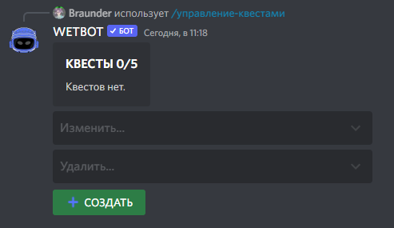
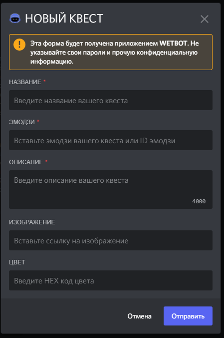
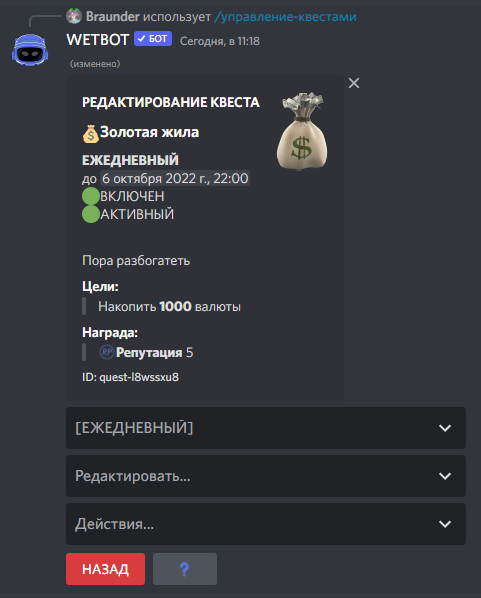

# Create quests

Execute the quest control panel with the command /manager-quests create \<name>

<figure><figcaption>
Управление квестами
</figcaption></figure>


If you are creating a quest for the first time, it will be the same as in the screenshot above


Click the create button, after which the bot will display the following window, it is primitively simple

<figure><figcaption>
Панель создание квеста
</figcaption></figure>

* Name - the name of the quest itself
* Quest emoji - server emoji id or standart emoji, in order to get the emoji id of the server, it is enough to write \ in the chat and then insert the emoji, the discord will give the id
* Description - description of the quest itself
* Image - copy the direct image link (How to do it? Google to help)
* Color - we take it from [here ](https://colorpicker.me/)or from another convenient site

After completion, we proceed to setting up the quest

<figure><figcaption>
Редактор квеста
</figcaption></figure>

### Choose the type of quest:

* Daily Quest - added to the pool of daily quests.
* Weekly - added to the pool of weekly quests.
* Community - quest with server-general progress.
* Repeated - can be reset after execution.

### Edit:

* Changing the name/emoji/description/picture/color
* Add a goal - a goal in order to complete the quest
* Edit a goal
* Add/Remove Reward
* Set Active
* Enable - enabling the quest

### Action:

* Add this quest to all users
* Delete this quest from all users
* Reset the progress of this quest for all users

After all the settings, the quest will look something like this:

<figure><figcaption></figcaption></figure>


You can add objects to goals:\
Let's say there is a goal "To fish 10 times", but if you add an object to this goal as an object, for example, a perch, then the goal will already be "Catch a Perch 10 times"\
For example, for the goal "To write 5 messages", you can add the channel ID as an object, then the goal will already be "Write 5 messages in a general chat" This gives a huge number of variations of goals.



— Daily/weekly quest with the "Repeated" type can be performed an unlimited number of times a day/ week — Daily/weekly inactive quests cannot be obtained randomly, but they can be obtained through the "Take a quest" button

