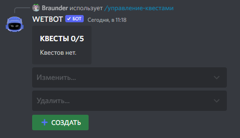
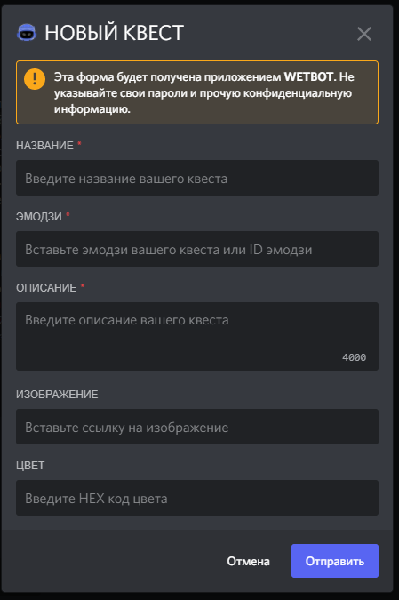
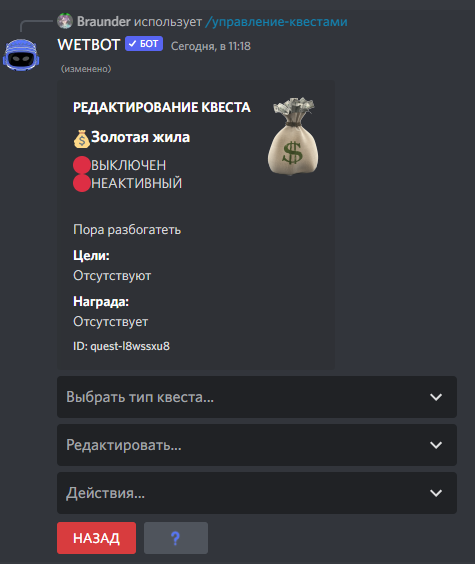
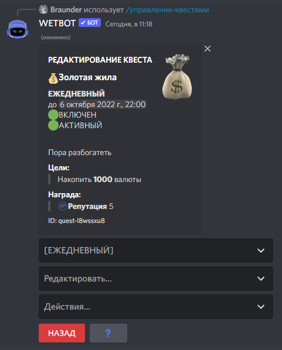

# Creating quests

Quests define goals (messages, items, crash, etc.) and rewards. Types: daily, weekly, community, repeatable.


Limit: **5** without premium, **1000** with premium.


Open the quest management panel with the command [/manager-quests](../commands/admins.md) create <name>

<figure><figcaption>
Quest management
</figcaption></figure>


If you are creating a quest for the first time, it will look the same as in the screenshot above.


Click the create button, and the bot will show the following window. It is very simple.

<figure><figcaption>
Quest creation panel
</figcaption></figure>

* Name - the name of the quest itself
* Quest emoji - an emoji ID or an emoji. To get the ID of a server emoji, just type `\` in chat and then insert the emoji; Discord will show the ID
* Description - the description of the quest
* Image - copy the image address or URL (How? Google can help)
* Color - take it from [here](https://colorscheme.ru/color-converter.html) or from any other convenient site

Once you are done, move on to configuring the quest

<figure><figcaption>
Quest editor
</figcaption></figure>

### Select the quest type...

* Daily quest - added to the pool of daily quests.
* Weekly - added to the pool of weekly quests.
* Community - a quest with shared progress.
* Repeatable - can be reset after completion.

### Edit...

* Change the name/emoji/description/image/color
* Add a goal - a goal that must be met to complete the quest
* Edit a goal
* Add / remove a reward
* Make active
* Enable - turns the quest on

### Action...

* Add this quest to all users
* Remove this quest from all users
* Reset this quest's progress for all users

After all the settings, the quest will look something like this

<figure><figcaption></figcaption></figure>


You can add objects to goals:\
Say there is a goal "Fish 10 times", but if you add an item as an object to this goal, for example a perch, the goal becomes "Catch Perch 10 times". Likewise, for the goal "Write 5 messages" you can add a channel ID as the object, and the goal becomes "Write 5 messages in the general chat".

This gives a huge number of goal variations.



— A daily/weekly quest with the "Repeatable" type can be completed an unlimited number of times per day/week \
— Inactive daily/weekly quests cannot be obtained randomly, but they can be obtained through the ["Take a quest"](buttons.md#take-a-quest) button


## On the website

Full catalog of task types, rewards, and permissions:


[quests.md](../website/quests.md)

