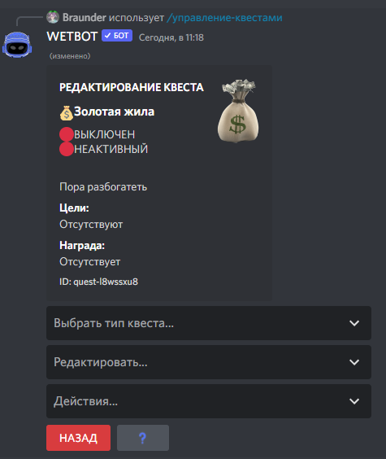

# Создание квестов

Вызываем панель управления квестами командой [/manager-quests](../commands/admins.md) create <название>

<figure><figcaption>
Управление квестами
</figcaption></figure>


Если вы создаете квест впервые, то будет так же как на скрине выше/


Нажимаем кнопку создать, после чего бот выдаст следующее окно, оно примитивно простое

<figure><figcaption>
Панель создание квеста
</figcaption></figure>

* Название - название самого квеста
* Эмодзи квеста - id эмодзи или эмодзи, для того чтобы получить id эмодзи сервера достаточно в чате написать `\` и после этого вставить эмодзи, дискорд выдаст id
* Описание - описание самого квеста
* Изображение - копируем адрес изображения или url (Как это сделать? Гугл в помощь)
* Цвет - берем от [сюда](https://colorscheme.ru/color-converter.html) или с другого удобного сайта

После завершения переходим к настройке квеста

<figure><figcaption>
Редактор квеста
</figcaption></figure>

### Выбрать тип квеста...

* Ежедневный квест - добавляется в пул ежедневных квестов.
* Еженедельный - добавляется в пул еженедельных квестов.
* Сообщество - квест с общим прогрессом.
* Повторный - можно обнулить после выполнения.

### Редактировать...

* Изменение названия/эмодзи/описания/картинки/цвета
* Добавить цель - цель для того, чтобы выполнить квест
* Редактировать цель
* Добавить / удалить награду
* Сделать активным
* Включить - включение квеста

### Действие...

* Добавить этот квест всем пользователям
* Удалить этот квест у всех пользователей
* Обнулить прогресс этого квеста у всех пользователей

После всех настроек квест будет выглядеть примерно так

<figure><figcaption></figcaption></figure>


К целям можно добавлять объекты:\
Допустим есть цель «Порыбачить 10 раз», но если к этой цели добавить объект в качестве предмета, например окуня, то цель уже будет «Выловить Окунь 10 раз» Например для цели «Написать 5 сообщений» можно в качестве объекта добавить ID канала, то цель уже будет «Написать 5 сообщений в общем чате»

Это дает огромное количество вариаций целей.



— Ежедневный/еженедельный квест с типом "Повторный" можно будет выполнять неограниченное кол-во раз в день/неделю \
— Ежедневные/еженедельные не активные квесты, нельзя будет получить случайным образом, но при этом их можно будет получить через кнопку ["Взять квест"](buttons.md#vzyat-kvest)


