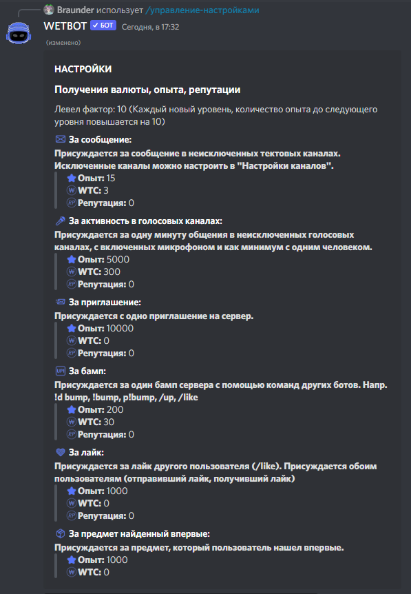

# Получение валюты, опыта, репутации

Чтобы настроить получение валюты/опыта/репутации нужно прописать команду [/manager-settings](../commands/admins.md) и в выпадающем меню выбрать **Получение валюты, опыта, репутации**

<figure><figcaption></figcaption></figure>

Левел фактор: 10 (Каждый новый уровень, количество опыта до следующего уровня повышается на 10)

* ️<mark style="color:purple;">За сообщение:</mark>\
  **Присуждается за сообщение в не исключённых текстовых каналах. Исключенные каналы можно настроить в "Настройки каналов".**
* <mark style="color:purple;">За активность в голосовых каналах:</mark>\
  **Присуждается за одну минуту общения в не исключённых голосовых каналах, с включенных микрофоном и как минимум с одним человеком.**\
  :warning:Активность в голосовых каналах считается, если в канале более одного ЧЕЛОВЕКА с включенным микрофоном.\
  :warning:Активность с выключенным микрофоном не считается
* &#x20;<mark style="color:purple;">За приглашение:</mark>\
  **Присуждается с одно приглашение на сервер.**\
  :warning:Для корректного отслеживания приглашения, у бота должно быть право "Управлять сервером". Это право необходимо для просмотра приглашений и их изменений.
* <mark style="color:purple;">За бамп:</mark>\
  **Присуждается за один бамп сервера с помощью команд других ботов. Например: /bump, /up, /like**
* <mark style="color:purple;">За лайк:</mark>\
  **Присуждается за лайк другого пользователя (/like). Присуждается обоим пользователям (отправивший лайк, получивший лайк)**
* <mark style="color:purple;">За предмет найденный впервые:</mark>\
  **Присуждается за предмет, который пользователь нашел впервые.**


При изменении параметра "левел фактор" бот автоматически изменит уровни пользователей в соответствии с новым левел фактором.

