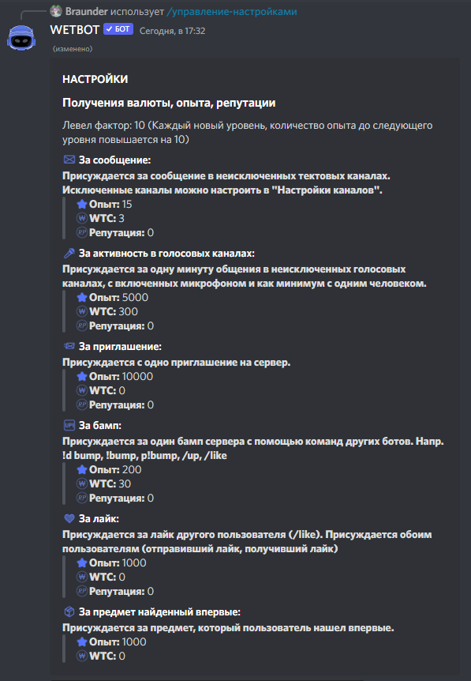

# Earning currency, experience, reputation

## What is this?

Base rewards for messages, voice, invites, bumps, likes, and the first discovery of an item. [Bonus channels](bonuses.md) and [luck](../rp-luck.md) also have an effect.

## Discord

Run [/manager-settings](../commands/admins.md) → **Earning currency, experience, reputation**.

<figure><figcaption></figcaption></figure>

**Level factor** (for example 10): each new level requires N more experience than the previous one to reach the next.

| Source | Rules |
| --- | --- |
| Per message | In text channels that are not excluded (muted ones are set in the channel settings) |
| Per voice activity | Per minute; more than 1 person with a microphone; bots don't count; muted users don't count |
| Per invite | Requires the bot's "Manage Server" permission |
| Per bump | `/bump`, `/up`, `/like` of other bots (rewards are premium) |
| Per like | `/like`; both sides receive the reward |
| Per item found for the first time | The first discovery of an item |


When the level factor changes, the bot recalculates users' levels.


Level roles and daily rewards are also in the settings; see [Setting up the bot](settings.md).

## On the website


[activities-channels.md](../website/settings/activities-channels.md)

