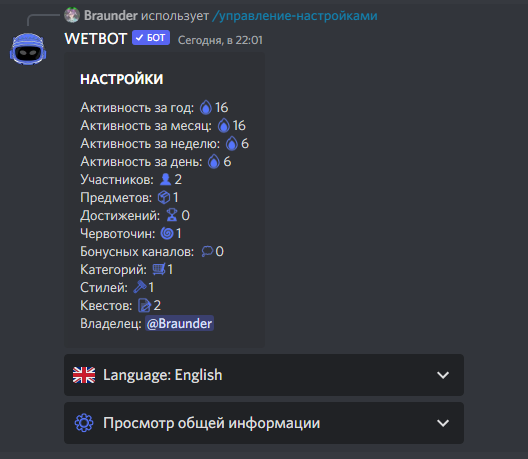

# ⚙️ Setting the bot

Execute the bot settings editing panel with the command [/manager-settings](../commands/admins.md)

<figure><figcaption>
Просмотр общей информации
</figcaption></figure>

Here you can configure:

* Fishing
* Mining
* Autovoice channels
* Shop
* Channels
* Roles
* [Server currency](currency.md)
* Daily rewards
* Roles for levels
* Top leaders reports
* Getting currency/experience/reputation
* Roles Counter-Strike 2
* Logs
* Starter Kit
* API
* Custom roles
* Market settings
