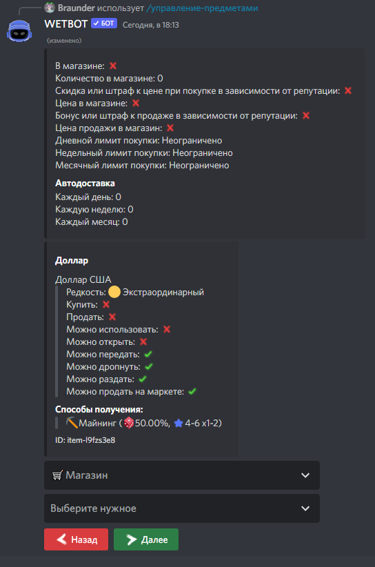

# 💳 Adding items to shop


If you still haven't created an item that you want to add to the shop, then go to the [Create Items](items.md) section.



[items.md](items.md)


How to add an item to the shop via the /manager-items command

\
An item can be added to the shop during the creation or modification of an item in the [How to create an item](items.md) section. Following the prompts and instructions, you will successfully add the item to the shop.

<figure><figcaption></figcaption></figure>

In the drop-down menu, you can configure:

* Amount of the item in the shop
* Set whether there will be a discount depending on the [reputation](../rp-luck.md)
* Set/Change the price of an item in the shop
* Set the sale price of the item
* Bonus or penalty for sale depending on [reputation](../rp-luck.md)
* Set/Change the sale price
* Change the purchase limit per day/week/month
* Change the number of deliveries per day/week/month (You can choose how the stand will be, replacing the quantity or adding to the quantity)

After all the settings in the same drop-down menu, click the "add to shop" button


In order for an item to be displayed in the shop, it must be created, visible, known, as well as the quantity in the store must be greater than zero.


### How to add an item to the store via the /shop-add-edit command:

The item can be added to the shop using the /shop-add-edit command. Arguments of the /shop-add-edit command:&#x20;

* Item - the name of the item you want to add to the shop
* Price - the price for which you can buy an item
* Price\_type - currency of the price, the currency can be any item or just the main currency of the server
* Amount- the number of items that will be in the shop
* Discount - true \[discount will apply to this item if the user's reputation (RP) is greater than zero. 1% discount - 20 RP], false \[discount will not apply to this item]
