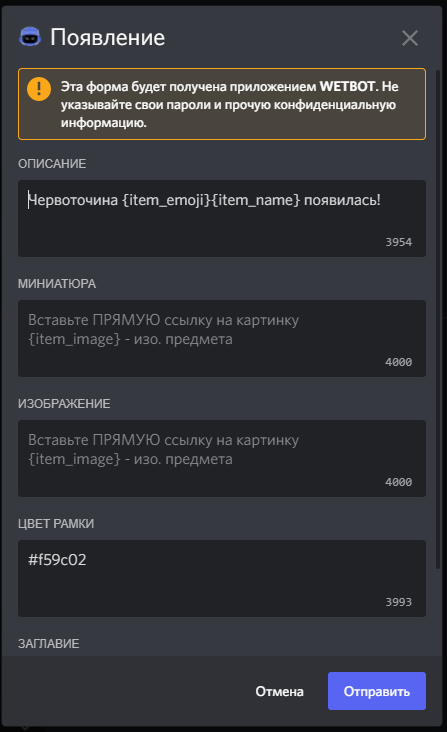
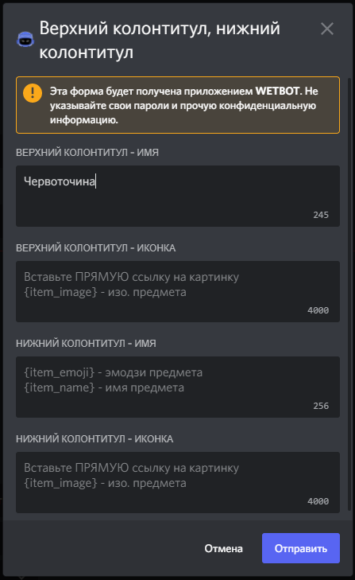
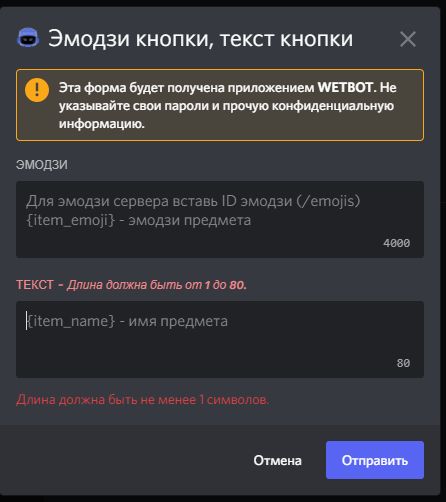
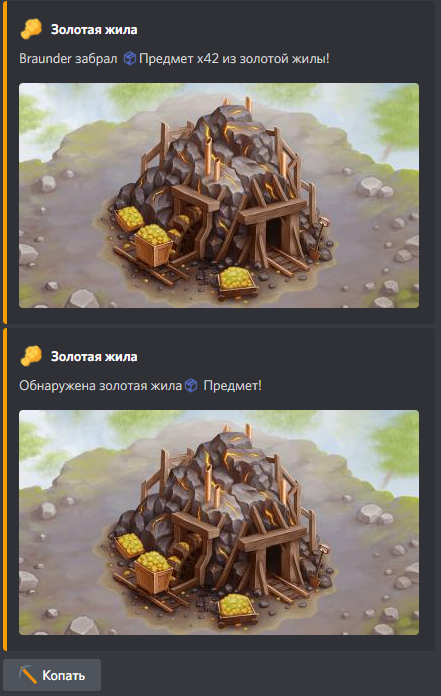

# 🎨 Create wormholes styles


[wormholes.md](wormholes.md)


Execute the style editing panel with the command /manager-styles

<figure><figcaption></figcaption></figure>

And click the create button and specify the name of the style, after which a panel with editing styles will appear

<figure><figcaption></figcaption></figure>

Click edit and select our newly created style.

<figure><figcaption></figcaption></figure>

The panel is very convenient because it immediately shows how the wormhole itself will look and how it will look after pressing the button

### Change the appearance style:

* Change the description, thumbnail, image, color...

<figure><figcaption></figcaption></figure>

1. Description - where {item\_emoji} is the emoji of the item, and {item\_name} is the name of the item
2. Thumbnail
3. Image
4. Embed color


Leave {item\_emoji} and {item\_name} unchanged if you are going to use the style for multiple wormholes with different items.



[styles.md](../variables/styles.md)


* Изменить верхний колонтитул, нижний колонтитул

<figure><figcaption></figcaption></figure>

* Изменить эмодзи кнопки, текст кнопки

<figure><figcaption></figcaption></figure>


В окне эмодзи не должно быть текста, если это не айди эмодзи сервера.


### Изменить стиль сбора...

* Изменить описание, миниатюру, изображение, цвет...
* Изменить верхний колонтитул, нижний колонтитул

После всех настроек у меня получилось так:

<figure><figcaption></figcaption></figure>
