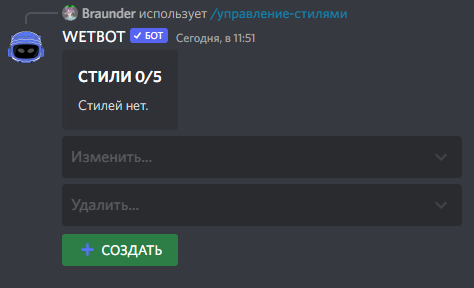
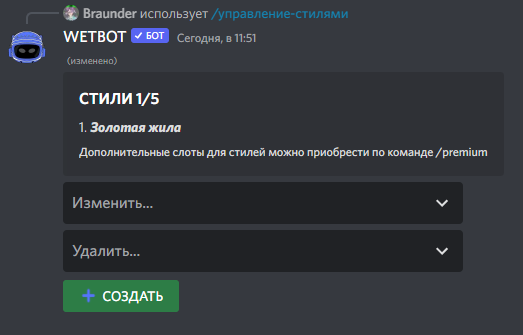
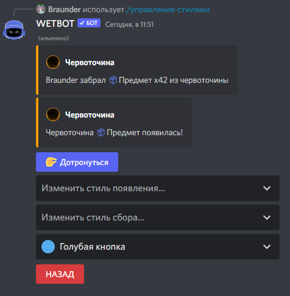
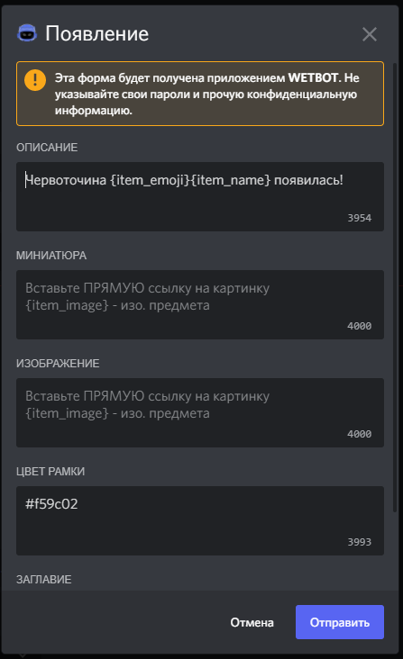
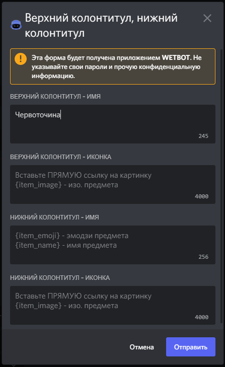
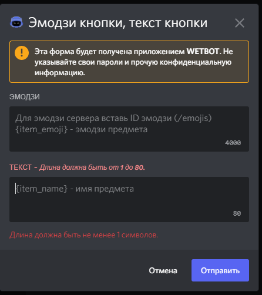
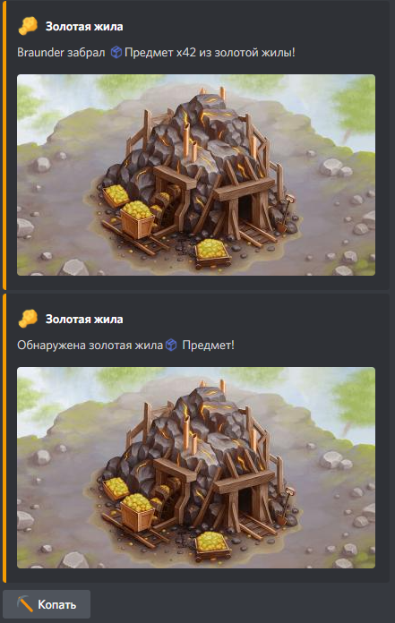

# Creating wormhole styles

Styles define the look of the wormhole embed when it appears and when it is collected.


Limit: **5** without premium, **25** with premium.



[wormholes.md](wormholes.md)


Open the style editing panel with the command [/manager-styles](../commands/admins.md)

<figure><figcaption></figcaption></figure>

Click the create button and enter a style name, after which the style editing panel appears

<figure><figcaption></figcaption></figure>

Click edit and select the style you just created.

<figure><figcaption></figcaption></figure>

The panel is very convenient because it immediately shows how the wormhole itself will look and how it will look after the button is clicked

### Edit the appearance style...

* Change the description, thumbnail, image, color...

<figure><figcaption></figcaption></figure>

1. <mark style="color:purple;">Description</mark> - where {item\_emoji} is the item's emoji and {item\_name} is the item's name
2. <mark style="color:purple;">Thumbnail</mark>
3. <mark style="color:purple;">Image</mark>
4. <mark style="color:purple;">Border color</mark>


Leave {item\_emoji} and {item\_name} unchanged `if you are going to use the style for several wormholes with different items.`



[styles.md](../variables/styles.md)


* Change the header and footer

<figure><figcaption></figcaption></figure>

* Change the button emoji and button text

<figure><figcaption></figcaption></figure>


The emoji field must not contain text unless it is the ID of a server emoji.


### Edit the collection style...

* Change the description, thumbnail, image, color...
* Change the header and footer

After all the settings, mine turned out like this:

<figure><figcaption></figcaption></figure>

Variables: [Variables: styles](../variables/styles.md).

## On the website


[styles.md](../website/styles.md)

