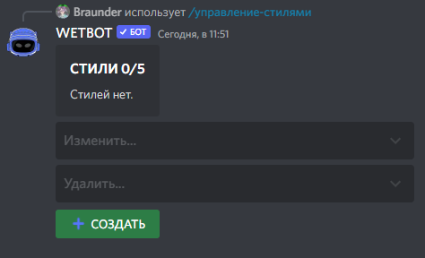
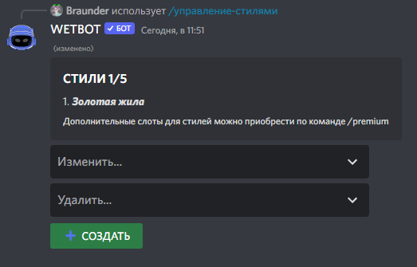

# Создание стилей червоточин


[wormholes.md](wormholes.md)


Вызываем панель редактирование стилей командой [/manager-styles](../commands/admins.md)

<figure><figcaption></figcaption></figure>

И нажимаем кнопку создать и указываем название стиля, после чего появиться панель с редактированием стилей

<figure><figcaption></figcaption></figure>

Нажимаем изменить и выбираем наш только что созданный стиль.

<figure><figcaption></figcaption></figure>

Панель очень удобна тем, что сразу показывает, как будет выглядеть сама червоточина и как будет выглядеть после нажатия кнопки

### Изменить стиль появления...

* Изменить описание, миниатюру, изображение, цвет...

<figure><figcaption></figcaption></figure>

1. <mark style="color:purple;">Описание</mark> - где {item\_emoji} - эмодзи предмета, а {item\_name} - название предмета
2. <mark style="color:purple;">Миниатюра</mark>
3. <mark style="color:purple;">Изображение</mark>
4. <mark style="color:purple;">Цвет рамки</mark>


Оставляйте неизменным {item\_emoji} и {item\_name} `если собираетесь использовать стиль для нескольких червоточин с разными предметами.`



[styles.md](../variables/styles.md)


* Изменить верхний колонтитул, нижний колонтитул

<figure><figcaption></figcaption></figure>

* Изменить эмодзи кнопки, текст кнопки

<figure><figcaption></figcaption></figure>


В окне эмодзи не должно быть текста, если это не айди эмодзи сервера.


### Изменить стиль сбора...

* Изменить описание, миниатюру, изображение, цвет...
* Изменить верхний колонтитул, нижний колонтитул

После всех настроек у меня получилось так:

<figure><figcaption></figcaption></figure>
