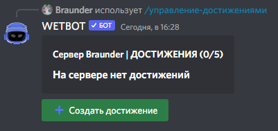

# Создание достижений

## Что это?

Достижения выдаются за прогресс (сообщения, войсы, предметы, краш и т.д.) и могут давать награды.


Лимит: **5** без премиума, **1000** с премиумом.


## Discord

Создание: [/manager-achievements create <название>](../commands/admins.md)

<figure><figcaption></figcaption></figure>

В редакторе задаются название, эмодзи, тип задачи, количество, связанные предметы/роли и награды (до 5).

### Типы, с которыми часто путаются

* **Кастомная цель** — не выдаётся автоматически, только админом
* **XX часов в войсе** — нужно >1 участника с микрофоном; боты не считаются
* **Получить XX лайков** — команда [/like](../commands/general.md)
* **Бампнуть сервер** — зависит от бамп-бота (`/bump`, `/up`, `/like`)
* **Найти все предметы** — редкость «Экстраординарный» не учитывается

Просмотр игроком: команды достижений в [профиле](../commands/profile.md).

## На сайте

Полный каталог типов задач:


[achievements.md](../website/achievements.md)

