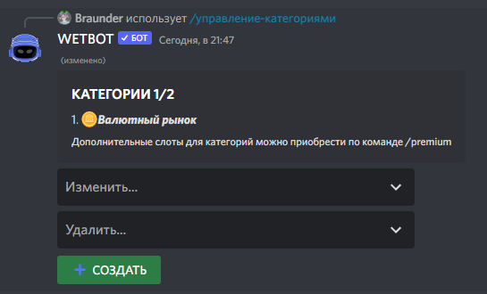

# Создание категории в магазине

## Что это?

Категории группируют товары в `/shop`. Предметы сначала настраиваются в магазине, затем добавляются в категорию.


Лимит: **5** без премиума, **25** с премиумом.



[items](items/)



[shop.md](items/shop.md)


## Discord

Команда [/manager-categories](../commands/admins.md)

<figure><figcaption></figcaption></figure>

Бот попросит название и эмодзи категории.

<figure><figcaption></figcaption></figure>

Далее **Изменить…** → выбрать категорию:

<figure><figcaption></figcaption></figure>

| Параметр              | Описание                        |
| --------------------- | ------------------------------- |
| Название / эмодзи     | Оформление                      |
| Предметы              | ID предметов категории          |
| Права на покупку      | Кто может покупать из категории |
| Стандартная категория | Категория по умолчанию          |

## На сайте


[categories.md](../website/categories.md)

