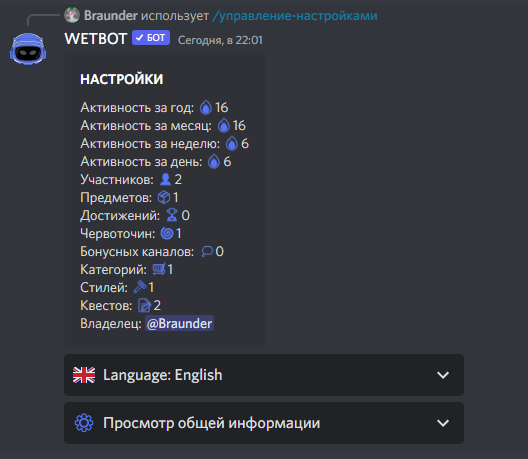

# Настройка бота

## Что это?

Центральные настройки сервера: валюта, каналы, активности, рыбалка, магазин, логи и многое другое.

## Discord

Вызовите панель командой [/manager-settings](../commands/admins.md)

<figure><figcaption>
Просмотр общей информации
</figcaption></figure>

В меню доступны группы:

| Группа                                 | Что настраивается                     |
| -------------------------------------- | ------------------------------------- |
| Рыбалка / Майнинг                      | Названия, иконки, цена попытки        |
| Автоголосовые каналы                   | Join-to-create; см. [AVC](avc.md)     |
| Магазин                                | Название, превью, сообщения           |
| Каналы                                 | Уведомления, маркет, раздачи, muted   |
| Роли                                   | Пинги, muted, роли новичкам           |
| [Валюта сервера](currency.md)          | Имя, эмодзи, запреты передачи         |
| Ежедневные награды                     | Награды по дням 1–7                   |
| Роли за уровни                         | Роль в диапазоне уровней              |
| Отчёты о топ лидерах                   | Авто-отчёты (премиум)                 |
| [Получение валюты/опыта](receiving.md) | Награды за активность                 |
| Роли CS2                               | Привязка Premier → роль               |
| Логи                                   | Вебхук и события (часть — премиум)    |
| Стартовый набор                        | Выдача новичкам                       |
| [API](../api/docs.md)                  | Документация API                      |
| [Кастомные роли](custom-role.md)       | Права и лимиты                        |
| Маркет / аукционы                      | Канал и срок лотов                    |
| Сезон / бустеры                        | Сезонные уровни, глобальные множители |


Расширенные логи, отчёты топа и кастомные эмодзи требуют [премиум](../premium.md).


## На сайте

Полные таблицы полей по всем вкладкам:


[settings](../website/settings/)

