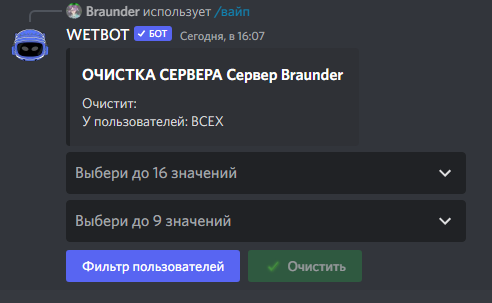

# Вайп

С помощью вайпа можно очистить всё, что связано с WETBOT.

<figure><figcaption></figcaption></figure>


Если хотите очистить только некоторых участников, укажите их в фильтре пользователей


Очистка:

* Статистика (Очищает показатель активности за всё время/год/месяц/день)
* Опыт и уровни (Очищает всех/пользователя к первоначальному значению 0 опыта)
* Валюта (Очищает показатель "Валюта" )
* Репутация (Очищает показатель "Репутация")
* Приглашения (Очищает показатель "Приглашения")
* Квесты пользователь (Сбрасывает пройденные квесты пользователей)
* Бонусы (Очищает все бонусы к опыту/валюте/репутации)
* Роли (Очищает все полученные роли с помощью предметов)
* Достижения пользователей (Очищает все достижения пользователей)
* Инвентарь (Очищает инвентарь)
* Магазин (Очищает магазин)
* Трофеи (Очищает все трофеи у пользователей)
* Кулдауны работы (Очищает все кулдауны работы)
* Стили (Удаляет все стили)
* Червоточины (Удаляет все червоточины)
* Достижения (Удаляет все достижения)
* Квесты (Удаляет все квесты)
* Категории (Удаляет все категории)
* Бонусные каналы (Удаляет у каналов возможность увеличенного получения опыта/валюты/репутации)
* Раздачи (Удаляет все раздачи)
* Лоты на маркете (Удаляет все лоты)
* Предметы (Удаляет все предметы)
* Подарки (Удаляет все подарки)
* Доходные роли (Удаляет все доходные роли)
* Права (Удаляет все права)
* Работа (Удаляют всю работу)
* Промокоды (Удаляет все промокоды)
* Автогенераторы промокодов (Удаляет все автогенераторы промокодов)
* Использование подарков (Удаляет все использования подарков)

