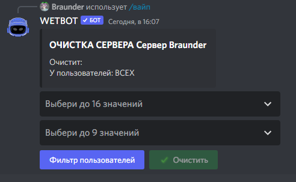

# Wipe

Wipe lets you clear everything related to WETBOT.

<figure><figcaption></figcaption></figure>


If you only want to clear specific members, specify them in the user filter


What can be cleared:

* Statistics (Clears the activity stats for all time/year/month/day)
* Experience and levels (Resets everyone/the user to the initial value of 0 experience)
* Currency (Clears the "Currency" value)
* Reputation (Clears the "Reputation" value)
* Invites (Clears the "Invites" value)
* User quests (Resets users' completed quests)
* Bonuses (Clears all bonuses to experience/currency/reputation)
* Roles (Clears all roles received through items)
* User achievements (Clears all users' achievements)
* Inventory (Clears the inventory)
* Shop (Clears the shop)
* Trophies (Clears all users' trophies)
* Job cooldowns (Clears all job cooldowns)
* Styles (Deletes all styles)
* Wormholes (Deletes all wormholes)
* Achievements (Deletes all achievements)
* Quests (Deletes all quests)
* Categories (Deletes all categories)
* Bonus channels (Removes the increased experience/currency/reputation gain from channels)
* Giveaways (Deletes all giveaways)
* Market listings (Deletes all listings)
* Items (Deletes all items)
* Gifts (Deletes all gifts)
* Income roles (Deletes all income roles)
* Permissions (Deletes all permissions)
* Jobs (Deletes all jobs)
* Promocodes (Deletes all promocodes)
* Promocode autogenerators (Deletes all promocode autogenerators)
* Gift uses (Deletes all gift uses)
